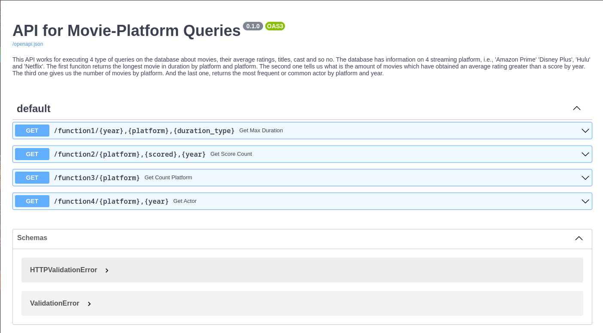

# Model for Recommendations

This repository displays through [gradio-app](https://github.com/gradio-app/gradio) two machine learning model applied in python for a movie-recomendation system. Both models aim at whether or not recommend a movie to a specific user, the first one is based on the Cosine Similarity Method and the second one employs the python library [surprise](https://github.com/NicolasHug/Surprise) build as a machine learning model to perform recommentacions.

Besides, this project guides throughout the different stage for consuming the final data, i.e., it shows the ETL, EDA and ML deployment needed to get the recommendation system.

## ETL & Deploy on FastAPI
> The project starts by cleasing the dataset avaible formed by csv files which contains informaiton of 22998 movies on diferent streaming platform such Amazon Prime, Disney, Hulu and Netflix, there's data about users and their rating for some movies.
>
> Each step for the data cleansing is located in the file [ETL.py](https://github.com/jpradas1/A_Model_Recommendation/blob/main/ETL.py), where the code is oriented to normalized all text by converting it in lowercase no exception. In the column rating missing values was replaced by 'g' (general audience) as well.
>
> Once the data has been cleaning, we have created an API using FastAPI framework to allows users consum data available, thanks to [render.com](https://render.com/), at [FastAPI deploy](https://a-model-recommendation.onrender.com/docs), so there anyone can perform queries on cleaned data.
>
> 
### How to run it
> The stable version to run the api is in the branch [fast-api](https://github.com/jpradas1/A_Model_Recommendation/tree/fast-api), there is the way to perform a suitable running.
## EDA
> The EDA is performed in the first Jupyter notebook ([Recommendation_System_1.ipynb](https://github.com/jpradas1/A_Model_Recommendation/blob/main/notebooks/Recommendation_System_1.ipynb)) located in the [notebook](https://github.com/jpradas1/A_Model_Recommendation/tree/main/notebooks) directory. This notebook provides a detailed analysis of the data, including visualizations and statistical summaries. The notebook also shows how the data is preprocessed before being fed into the machine learning models, where the use has been made of libraries as 'pandas', 'seaborn', 'pandas_profiling' and so on.
>
## Machine Learning
> As it was said before the machine learning models to generated a system to recommend movies are [Cosine Similarity](https://github.com/jpradas1/A_Model_Recommendation/blob/main/notebooks/Recommendation_System_2.ipynb) and [Surprise library](https://github.com/jpradas1/A_Model_Recommendation/blob/main/notebooks/Recommendation_System_3.ipynb). Each model is developed along their respective notebook. However, the script [Recommendation_System.py](https://github.com/jpradas1/A_Model_Recommendation/blob/main/Recommendation_System.py) runs the model itself.
### Gradio APP
> It's been created the python script [gradio-app](https://github.com/jpradas1/A_Model_Recommendation/blob/main/gradio-app.py) in order to perform a graphic environment. To run it just do
```
pip install gradio
gradio gradio-app.py
```
> This is going to create the graphic environment in the localhost on the port 7860, i.e., http://127.0.0.1:7860/.
> Otherwise, there's important variable to talk about:
> Because we can choose between to model to predict whether or not a movie is recommented to a certain user, it has been created variable to handle with:
> - usr: int. This is the id of the user
> - title: str. The name of the movie (be sure is the exact title)
> - Knn: bool. Decide if it'll perfome the cosine model
> - Surprise: bool. Decide if it'll perfome the surprise's model
> - similarity: float (0.3 - 1.0). Cosine's threshold to decide the model is whether or not recommended
> - grade: float (2 - 5). Surprise's threshold to decide the model is whether or not recommended
> - threshold: int (300 - 600). Filter data feeding the model by the number of times the movie has been graded
> - KNeighbors: int (8 - 32). Number of neighbors the model will take into account.
>
> if both model are select each selection indice will be weighted at 0.5 and they will be summed.
